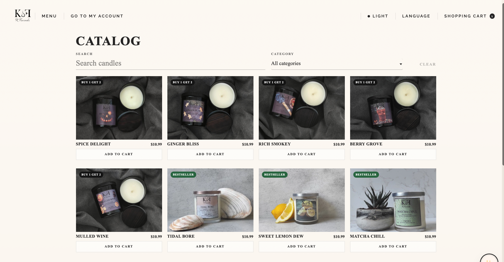
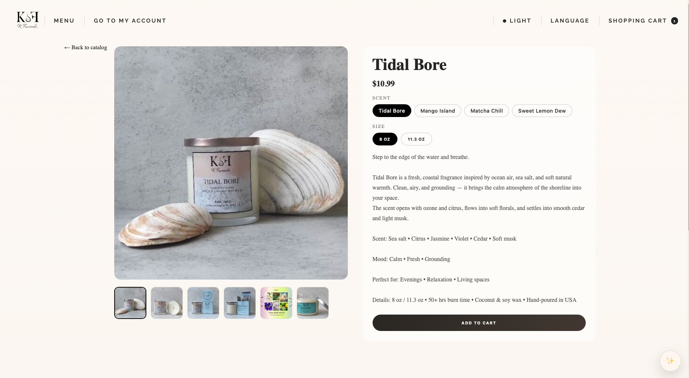
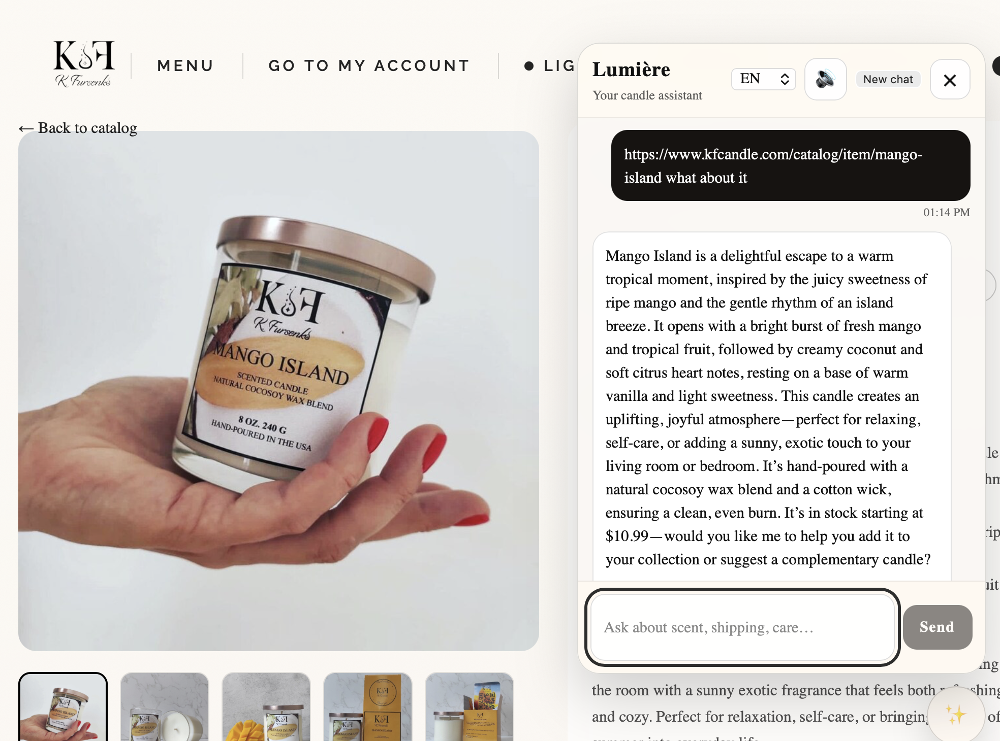
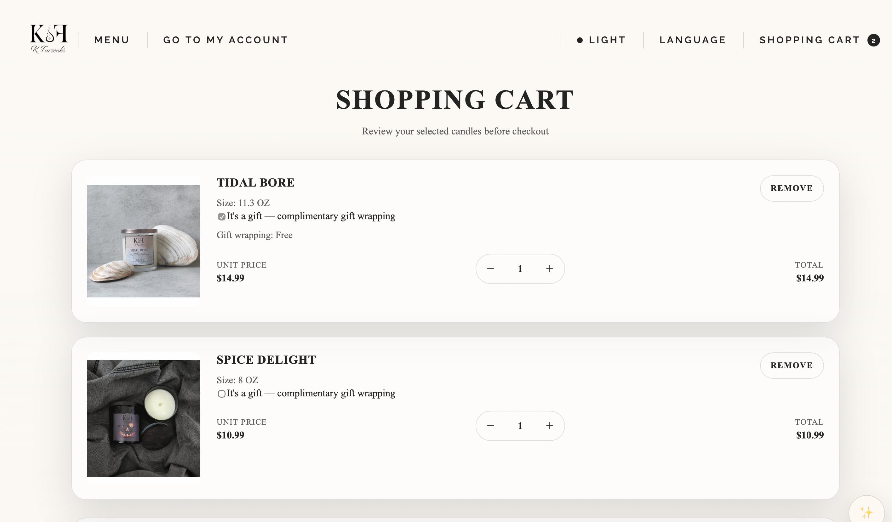

# KFursenko Candles Store

KFursenko Candles Store is a modern full-stack e-commerce platform for handcrafted candles, built with a strong focus on accessibility (WCAG 2.1), performance, and real-world usability.

The application is designed as a production-ready product, combining a clean, minimal interface with a scalable architecture and secure data handling. The goal is not only to present products, but to guide users through a smooth and intuitive purchasing journey — from discovery to checkout.

Live link: https://www.kfcandle.com

---

## Preview

### Homepage

### Product Catalog

### Product Detail

### AI-powered assistant

### Cart & Checkout

---

## Key Features

- AI-powered assistant (**Lumière**) with multilingual support (EN, RU, ES, FR)
- Personalized product discovery via interactive quiz
- Guest + authenticated cart system
- JWT authentication with automatic token refresh
- Real-time product filtering and search
- Responsive and accessible UI (WCAG 2.1, Section 508)
- Scalable full-stack architecture (React + Django)

---

## Product Experience

The platform is designed around real user behavior and expectations in modern e-commerce:

- Clear product presentation with structured catalog and filtering
- Fast navigation with minimal friction between pages
- Consistent UI across all devices
- Seamless add-to-cart and checkout flow
- Interface that responds instantly to user actions with clear feedback
- Stable performance as product data grows

Each interaction is intentionally simplified to reduce cognitive load, improve usability, and increase conversion.

---

## Personalization

The platform enhances product discovery through a combination of an interactive quiz and an AI-powered assistant.

Users can take a guided quiz to identify their scent preferences, allowing the system to recommend products that match their taste instead of relying on random browsing.

### Lumière — AI Assistant

The platform includes an AI assistant named **Lumière** (French for *“light”*), reflecting the essence of the brand — warmth, atmosphere, and guidance.

Lumière acts as a knowledgeable in-store consultant, helping users:
- understand scent profiles and fragrance families
- discover products based on mood and preferences
- receive personalized recommendations in real time

The assistant supports **multiple languages (English, Russian, Spanish, and French)**, making the experience more accessible to a wider audience.

This multilingual capability improves usability, reduces friction for non-English speakers, and reflects a product decision to prioritize inclusivity and global accessibility.

Together, the quiz and AI assistant reduce decision fatigue, increase user confidence, and create a more personalized shopping experience.

---

## Technical Challenges & Solutions

**1. Guest vs authenticated cart logic**  
Implemented a dual cart system using localStorage for guest users and backend storage for authenticated users, with seamless synchronization after login.

**2. Token expiration handling**  
Prevented session interruptions by implementing Axios interceptors with automatic JWT refresh logic.

**3. Flexible product search**  
Improved search accuracy by combining slug parsing, normalized queries, and fuzzy matching techniques.

**4. AI assistant reliability**  
Designed the assistant to rely strictly on real backend product data, preventing hallucinated recommendations.

---

## Security and Data Handling

Security is treated as a core part of the product, not an afterthought.

- Authentication is implemented using JWT (access and refresh tokens)
- Tokens are securely stored and automatically refreshed
- Sensitive operations are protected through backend validation
- No payment data is stored on the client side
- Payment processing is handled by Stripe (PCI-compliant)

This approach ensures that user data is protected and the system is ready for real-world usage.

---

## Performance and Reliability

The application is optimized to provide a fast and stable experience:

- Efficient state management using Redux Toolkit
- Optimized API communication through a centralized Axios instance
- Automatic token refresh without interrupting user sessions
- Clean and modular component architecture
- Production build optimized with Vite

The system is designed to scale without degrading performance or user experience.

---

## Architecture

The project follows a full-stack architecture with clear separation of concerns.

### Frontend
- React with TypeScript
- Redux Toolkit for state management
- React Router for navigation
- Axios with interceptors for API handling

### Backend
- Django REST Framework
- PostgreSQL database
- Token-based authentication (JWT)

This structure allows the product to evolve easily, supporting future features such as payments, analytics, and admin tools.

---

## Accessibility

Accessibility is treated as a core product requirement rather than a compliance checkbox.

The platform is designed with WCAG 2.1 and Section 508 standards in mind, ensuring that users with different abilities can interact with the product without barriers.

Key accessibility considerations include:

- Semantic HTML structure for screen reader compatibility
- Full keyboard navigation support
- Proper focus management and visible focus states
- ARIA attributes to enhance assistive technology support
- High-contrast UI in both light and dark modes

The AI assistant also includes voice support, allowing users to interact with the system through audio, extending usability beyond traditional visual interfaces.

Accessibility decisions are integrated into the development process from the start, improving usability for all users.

---

## Business Value

This project demonstrates the ability to build a real-world e-commerce product focused on measurable outcomes:

- Improving product discovery through personalization
- Reducing friction in the purchase flow
- Ensuring secure handling of user data
- Building a scalable and maintainable frontend architecture
- Delivering a production-ready user experience

The result is not a demo application, but a functional foundation for a commercial product.

---

## Author

Kseniia Rostovskaia  
Full-Stack Developer | React, TypeScript, Django | AI Integration  

Portfolio: https://kseniiaross.dev  
LinkedIn: https://www.linkedin.com/in/kseniia-rostovskaia